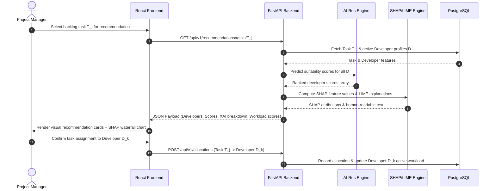

# System Architecture & Technical Design

This document details the software architecture, module breakdown, data processing pipelines, and mathematical models driving **Project Dhara**.

---

## 1. High-Level Architecture Overview

Dhara adopts a modular multi-tier architecture designed to cleanly separate presentation, application server, machine learning pipeline, explainability calculations, and data persistence.

```
+-----------------------------------------------------------------------------------+
|                                  FRONTEND LAYER                                   |
|   React + TypeScript + Tailwind CSS Management Web Interface                      |
|   - Task Backlog Component      - Developer Workload & Capacity Grid              |
|   - Recommendation Panel        - Visual XAI Explainer (SHAP Waterfall / LIME)    |
+------------------------------------------+----------------------------------------+
                                           | HTTP REST / JSON
                                           v
+-----------------------------------------------------------------------------------+
|                                  BACKEND API LAYER                                |
|   FastAPI Application Server (Python 3.10+)                                       |
|   - Task Management Endpoints   - Developer Profile Management API                |
|   - Recommendation Dispatcher   - Assignment Audit Logger                         |
+------------------------------------------+----------------------------------------+
                                           | Async Internal Pipeline Calls
                                           v
+-----------------------------------------------------------------------------------+
|                                   AI & XAI ENGINE                                 |
|   Python Machine Learning & Explainability Service                                |
|   +------------------------------------+--------------------------------------+   |
|   | ML Recommendation Engine           | Workload Balancing Module            |   |
|   | (Scikit-Learn / XGBoost)           | (Fairness Scoring & Redistribution)  |   |
|   +------------------------------------+--------------------------------------+   |
|   | Explainable AI (XAI) Engine                                               |   |
|   | (SHAP TreeExplainer & LIME Tabular Explainer)                             |   |
|   +---------------------------------------------------------------------------+   |
+------------------------------------------+----------------------------------------+
                                           | Database ORM Connections
                                           v
+-----------------------------------------------------------------------------------+
|                                  PERSISTENCE LAYER                                |
|   - PostgreSQL (Relational Data: Developers, Tasks, Allocations, Skills)           |
|   - Redis Cache (SHAP Calculation Matrix Caching & Session State)                 |
+-----------------------------------------------------------------------------------+
```

---

## 2. Core System Modules

### Module 1: Developer Profile Engine
Manages dynamic developer attributes updated continuously from commit data, completed tasks, and current availability:
- **Tech Skills Vector**: Normalized matrix of skill proficiencies (e.g., Python: 0.9, React: 0.8, PostgreSQL: 0.7).
- **Historic Performance Index**: Average completion speed, bug re-opening rate, and task complexity score.
- **Current Workload Vector**: Active in-progress task count, estimated remaining effort hours, and deadline proximity.

### Module 2: Task Engine
Processes and structures backlog items (User Stories, Bug Reports, Refactoring Tasks):
- Extracts task requirements: required programming languages, frameworks, domain tags.
- Estimates task complexity rating ($1 \le Complexity \le 5$) and effort hours.

### Module 3: AI Recommendation Engine
Evaluates developer-task compatibility by constructing a joint feature vector:
$$\text{Feature Vector } X_i = [\text{SkillMatch}_i, \text{SimilarTaskExperience}_i, \text{HistoricVelocity}_i, \text{CurrentWorkload}_i, \text{Availability}_i]$$
Model produces a suitability prediction score $S(d_i, t_j) \in [0, 100\%]$.

### Module 4: Explainable AI (XAI) Engine
Calculates explicit feature attributions for every recommendation:
- **SHAP (SHapley Additive exPlanations)**: Calculates the marginal contribution $\phi_i$ of each attribute towards the final score:
  $$S(d_i, t_j) = \phi_0 + \sum_{k=1}^{M} \phi_k$$
  Where $\phi_0$ is the base expected score, and $\phi_k$ is the impact of feature $k$.
- **LIME (Local Interpretable Model-Agnostic Explanations)**: Generates human-readable local explanations detailing positive vs negative decision drivers.

### Module 5: Workload Balancing & Fairness Engine
Calculates developer Capacity Load ($W_i$) to prevent developer overload and ensure fair distribution:
$$W_i = \left( \frac{\sum_{t \in Active} \text{Complexity}(t) \times \text{Hours}(t)}{\text{Max Weekly Hours}} \right) \times 100\%$$
- **Fairness Redistribution Rule**: If $W_i > 80\%$, the system applies a workload penalty score to $S(d_i, t_j)$ and flags alternative available developers with similar skill profiles.

---

## 3. End-to-End Task Recommendation Sequence


