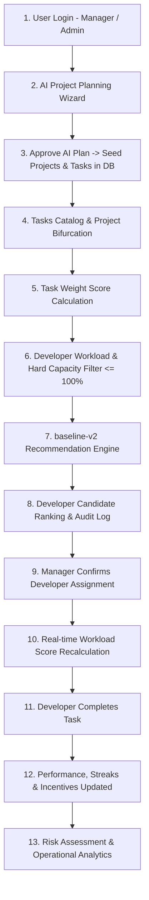

# COMPLETE DEVAlign BUSINESS WORKFLOW — Data Flow Architecture

This document details the end-to-end connected business workflow of **DevAlign AI**, tracing data from user authentication to AI project planning, task weighting, recommendation scoring, developer allocation, performance tracking, incentives, and delivery analytics.

---

## 1. High-Level Connected Business Diagram

---

## 2. Detailed Data Flow Step Breakdown

1. **Session Authentication**: Manager logs in via `POST /api/auth/login`. Receives JWT bearer token storing `user_id` and `role`.
2. **AI Project Planning**: Manager enters natural language project specs. `ai_planning_provider.py` translates specs into structured tasks, effort hours, complexity ratings, and required skills.
3. **Plan Approval & DB Seeding**: Clicking "Approve Plan" executes `POST /api/ai-planning/plans/{id}/apply`. Inserts `Project`, `Task`, and `TaskSkill` records into PostgreSQL.
4. **Task Weighting**: `task_weight_service.py` automatically calculates `task_weight_score` based on hours, complexity, and priority.
5. **Workload Analysis & Hard Constraints**: When recommendations are requested (`POST /api/recommendations/recommend`), `workload_service.py` evaluates all developer workloads. Developers over $100\%$ capacity or with $0\%$ skill match are excluded by hard constraints.
6. **`baseline-v2` Candidate Scoring**: Evaluates eligible developers via feature-weighted scoring vector:
   $$\text{Score} = (0.45 \times \text{SkillMatch}) + (0.25 \times \text{Availability}) + (0.15 \times \text{Performance}) - (0.15 \times \text{Workload Penalty})$$
7. **Assignment & Workload Recalculation**: Clicking "Assign Developer" creates an `ACTIVE` row in `assignments`, sets `tasks.status` to `IN_PROGRESS`, and updates the assigned developer's `workload_score`.
8. **Task Completion & Incentives**: Upon task completion (`TaskStatus.COMPLETED`), `performance_service.py` updates developer completion rate, recalculates streaks, awards achievement badges, and logs points in `developer_incentive_ledger`.
9. **Risk Assessment**: `risk_assessment_service.py` continuously monitors project delivery risk based on overdue task ratios, workload saturation, and skill coverage gaps.
