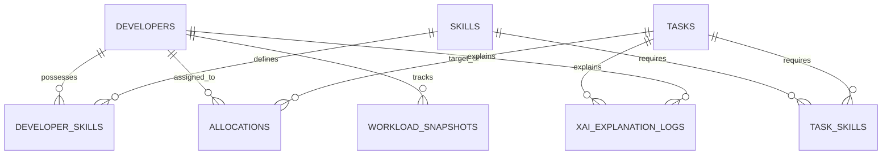

# Database Schema & Data Models

This document defines the relational database architecture, Entity-Relationship Diagram (ERD), table structures, indexing strategies, and constraints for **Project Dhara** implemented in PostgreSQL.

---

## 1. Entity-Relationship Diagram (ERD)



---

## 2. Table Specifications

### 2.1 `developers`
Stores developer profile data, experience level, and active status.

| Column Name | Data Type | Constraints | Description |
| :--- | :--- | :--- | :--- |
| `id` | `UUID` | `PRIMARY KEY, DEFAULT gen_random_uuid()` | Unique identifier. |
| `dev_code` | `VARCHAR(20)` | `UNIQUE, NOT NULL` | Anonymized developer ID (e.g. `DEV-104`). |
| `name` | `VARCHAR(100)` | `NOT NULL` | Developer full name. |
| `email` | `VARCHAR(255)` | `UNIQUE, NOT NULL` | Developer contact email. |
| `experience_years`| `NUMERIC(4,1)`| `NOT NULL, CHECK (experience_years >= 0)`| Years of professional experience. |
| `current_capacity_score`| `NUMERIC(5,2)`| `DEFAULT 0.0` | Active workload score ($0 - 100\%$). |
| `max_weekly_hours`| `INTEGER` | `DEFAULT 40, NOT NULL` | Max available capacity per week. |
| `is_active` | `BOOLEAN` | `DEFAULT TRUE` | Active availability status. |
| `created_at` | `TIMESTAMPTZ` | `DEFAULT CURRENT_TIMESTAMP` | Profile creation timestamp. |

### 2.2 `skills`
Master catalog of technical skills, programming languages, and frameworks.

| Column Name | Data Type | Constraints | Description |
| :--- | :--- | :--- | :--- |
| `id` | `UUID` | `PRIMARY KEY` | Unique skill ID. |
| `name` | `VARCHAR(50)` | `UNIQUE, NOT NULL` | Skill name (e.g. `Python`, `PostgreSQL`, `React`). |
| `category` | `VARCHAR(50)` | `NOT NULL` | Category (`Language`, `Framework`, `Database`, `DevOps`). |

### 2.3 `developer_skills`
Junction table mapping developer proficiency per skill.

| Column Name | Data Type | Constraints | Description |
| :--- | :--- | :--- | :--- |
| `developer_id` | `UUID` | `FK -> developers.id, ON DELETE CASCADE` | Developer reference. |
| `skill_id` | `UUID` | `FK -> skills.id, ON DELETE CASCADE` | Skill reference. |
| `proficiency_score`| `NUMERIC(3,2)`| `NOT NULL, CHECK (score BETWEEN 0.0 AND 1.0)` | Skill proficiency vector weight. |
| **PRIMARY KEY** | `(developer_id, skill_id)` | | Composite Key. |

### 2.4 `tasks`
Software backlog tasks requiring developer assignment.

| Column Name | Data Type | Constraints | Description |
| :--- | :--- | :--- | :--- |
| `id` | `UUID` | `PRIMARY KEY` | Unique task ID. |
| `task_key` | `VARCHAR(20)` | `UNIQUE, NOT NULL` | Jira/Backlog key (e.g. `DHARA-102`). |
| `title` | `VARCHAR(255)` | `NOT NULL` | Task title. |
| `description` | `TEXT` | `NOT NULL` | Full description text. |
| `category` | `VARCHAR(50)` | `NOT NULL` | Type (`Bug`, `Feature`, `Refactor`, `Docs`). |
| `priority` | `VARCHAR(20)` | `NOT NULL` | Priority (`Low`, `Medium`, `High`, `Critical`). |
| `complexity_rating`| `INTEGER` | `NOT NULL, CHECK (rating BETWEEN 1 AND 5)` | Task complexity weight. |
| `estimated_hours` | `NUMERIC(5,1)`| `NOT NULL, CHECK (estimated_hours > 0)` | Estimated effort hours. |
| `status` | `VARCHAR(30)` | `DEFAULT 'BACKLOG'` | Status (`BACKLOG`, `ASSIGNED`, `IN_PROGRESS`, `DONE`). |
| `deadline` | `TIMESTAMPTZ` | | Task completion deadline. |
| `created_at` | `TIMESTAMPTZ` | `DEFAULT CURRENT_TIMESTAMP` | Task creation timestamp. |

### 2.5 `allocations`
Records confirmed task assignments to developers.

| Column Name | Data Type | Constraints | Description |
| :--- | :--- | :--- | :--- |
| `id` | `UUID` | `PRIMARY KEY` | Allocation ID. |
| `task_id` | `UUID` | `FK -> tasks.id` | Target assigned task. |
| `developer_id` | `UUID` | `FK -> developers.id` | Assigned developer. |
| `assigned_by` | `VARCHAR(100)` | `NOT NULL` | Project Manager / User identity. |
| `confidence_score`| `NUMERIC(5,2)`| `NOT NULL` | AI recommendation confidence at assignment time. |
| `assigned_at` | `TIMESTAMPTZ` | `DEFAULT CURRENT_TIMESTAMP` | Allocation timestamp. |

### 2.6 `xai_explanation_logs`
Audit log storing computed SHAP feature attributions and LIME explanation payloads.

| Column Name | Data Type | Constraints | Description |
| :--- | :--- | :--- | :--- |
| `id` | `UUID` | `PRIMARY KEY` | Log entry ID. |
| `task_id` | `UUID` | `FK -> tasks.id` | Target task. |
| `developer_id` | `UUID` | `FK -> developers.id` | Evaluated developer. |
| `recommendation_rank`| `INTEGER`| `NOT NULL` | Rank assigned to developer ($1, 2, 3$). |
| `suitability_score`| `NUMERIC(5,2)`| `NOT NULL` | Predicted percentage ($0 - 100\%$). |
| `shap_values` | `JSONB` | `NOT NULL` | Dict of feature names to SHAP $\phi$ impact values. |
| `lime_explanation` | `TEXT` | `NOT NULL` | Human-readable LIME summary text. |
| `computed_at` | `TIMESTAMPTZ` | `DEFAULT CURRENT_TIMESTAMP` | Calculation timestamp. |

---

## 3. Database Indexing Strategy

```sql
-- Fast lookup for dynamic workload tracking
CREATE INDEX idx_developers_capacity ON developers(current_capacity_score) WHERE is_active = TRUE;

-- Fast backlog filtering by status and priority
CREATE INDEX idx_tasks_status_priority ON tasks(status, priority);

-- GIN Index for fast JSON query execution on XAI logs
CREATE INDEX idx_xai_logs_shap_jsonb ON xai_explanation_logs USING GIN (shap_values);

-- Foreign key lookup indexes
CREATE INDEX idx_allocations_dev_task ON allocations(developer_id, task_id);
```
