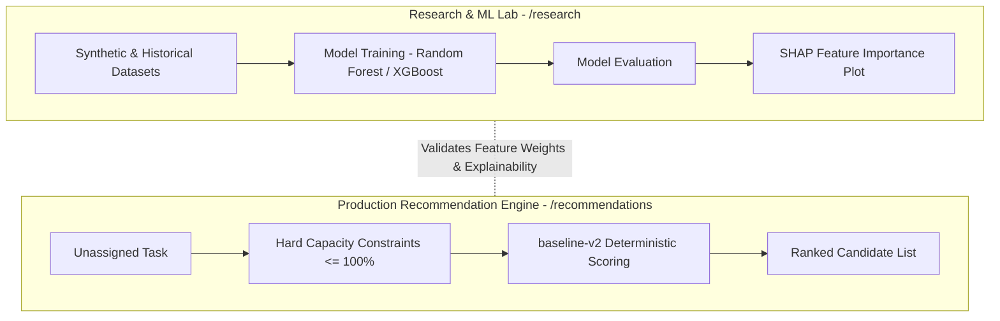

# RECOMMENDATION ENGINE COMPLETE VIVA GUIDE — Baseline-v1 vs Baseline-v2 vs ML

This guide provides a beginner-friendly explanation of `baseline-v1`, `baseline-v2`, the machine learning classifier, SHAP explainability, and the boundary between Production and Research.

---

## 1. Simple Explanation for Beginners

- **`baseline-v1`**: A basic rule-based formula that adds up points for skills, availability, and performance.
- **`baseline-v2`**: Our enterprise production recommendation engine. It adds **hard safety rules**—such as automatically blocking developers who are over 100% workload capacity or have 0% skill match—before applying weighted scoring.
- **The Machine Learning Model**: A Random Forest / XGBoost classifier in `research/ml/`. It was trained on historical assignment datasets (`research/data/`) to analyze feature importance and generate SHAP explainability plots.

---

## 2. Why does `baseline-v2` exist alongside the ML Model?

In enterprise engineering management:
1. **Zero Hallucination Guarantee**: Production resource allocation cannot risk non-deterministic AI decisions or sudden latency spikes.
2. **Hard Constraint Enforcement**: Overloaded developers must never be assigned tasks, regardless of ML probabilities.
3. **Role of ML**: The ML model in the Research Lab proves feature importance and validates scoring weights via SHAP. `baseline-v2` encodes those validated weights into a fast, 100% deterministic decision engine.

---

## 3. Production vs Research Diagram

